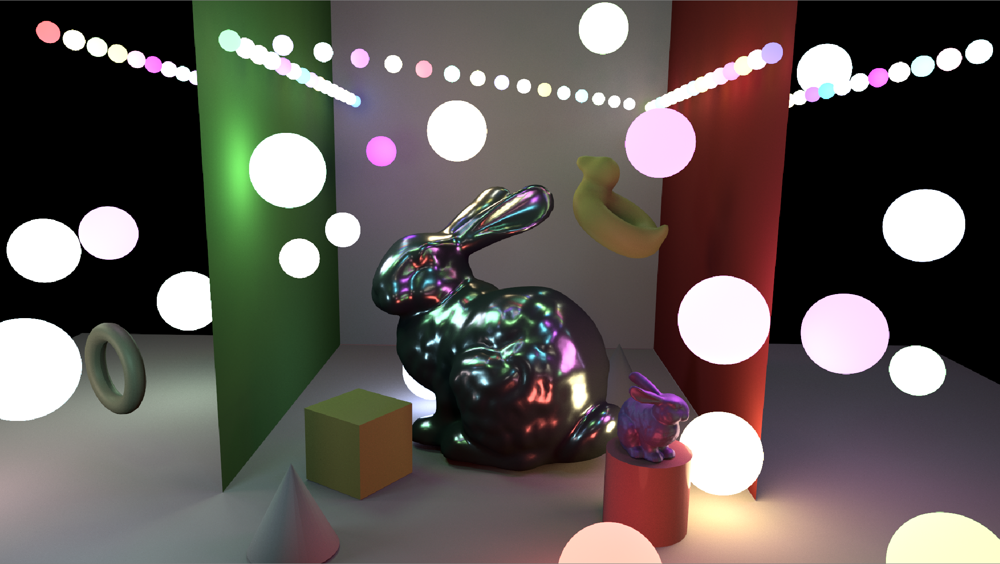
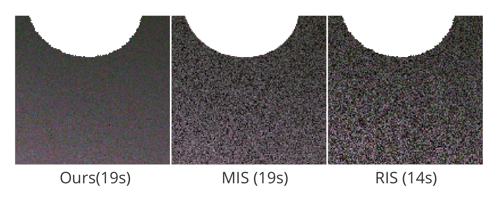

# ReSTIR lajolla





This is an implementation of ReSTIR with spatial reuse in [lajolla](https://github.com/BachiLi/lajolla_public), UCSD CSE 272 renderer.

# Build
All the dependencies are included. Use CMake to build.
If you are on Unix systems, try
```
mkdir build
cd build
cmake ..
```
It requires compilers that support C++17 (gcc version >= 8, clang version >= 7, Apple Clang version >= 11.0, MSVC version >= 19.14).

Apple M1 users: you might need to build Embree from scratch since the prebuilt MacOS binary provided is built for x86 machines.

# Run

The test scene is located at `scenes/restir_test_scene/test.xml`. Please directly change the parameters to tune the result. Try 
```
cd build
./lajolla ../scenes/manylight/test.xml
```
This will generate an image "image.exr".

To view the image, use [hdrview](https://github.com/wkjarosz/hdrview), or [tev](https://github.com/Tom94/tev).
